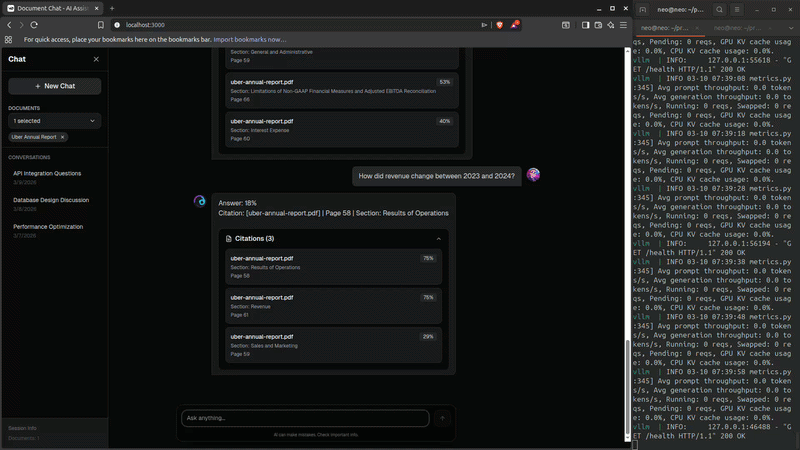

# Edge AI Gateway

> Private LLM inference + document RAG pipeline running on a single consumer GPU.
> No OpenAI. No cloud LLM. Your data never leaves your infrastructure.



---

## What This Is

A production-grade AI infrastructure stack built to demonstrate what's possible on consumer hardware. Ask questions about any PDF document — financial reports, legal contracts, research papers — and get cited answers with exact page numbers and confidence scores, powered entirely by a local quantized LLM.

**This runs on an RTX 4060 laptop with 8GB VRAM.**

---

## Architecture

```
Browser (Next.js)
      ↓
FastAPI Gateway :8080
      ↓              ↓
vLLM :8000      Qdrant Cloud
(Qwen 3B AWQ)   (hybrid search)

Prometheus → Grafana
```

**Retrieval pipeline:**
```
PDF → Docling → Hierarchical Chunker → BGE-base (dense) + SPLADE (sparse)
                                                        ↓
Query → embed → RRF fusion → parent-child expansion → vLLM → cited answer
```

---

## Stack

| Layer | Technology | Why |
|---|---|---|
| Model serving | vLLM + AWQ INT4 | PagedAttention, 4x VRAM reduction |
| API gateway | FastAPI + Uvicorn | Async, Prometheus metrics, concurrency |
| PDF parsing | Docling | AI layout analysis, table extraction |
| Chunking | Hierarchical parent-child | Precision retrieval + full context |
| Dense embeddings | BGE-base-en-v1.5 (CUDA) | 768d semantic vectors |
| Sparse embeddings | SPLADE PP v1 | Exact term matching |
| Vector search | Qdrant Cloud | Hybrid RRF fusion, filterable HNSW |
| Observability | Prometheus + Grafana | Latency, throughput, active requests |
| Frontend | Next.js | Chat UI, citations, document selector |
| Containers | Docker Compose | One-command deployment |

---

## Quick Start

**Prerequisites:** Docker, NVIDIA GPU (8GB+ VRAM), nvidia-container-toolkit

```bash
# 1. Clone and configure
git clone https://github.com/amika-d/edge-ai-infra
cd edge-ai-infra
cp .env.example .env
# Fill in HF_TOKEN, QDRANT_URL, QDRANT_API_KEY

# 2. Download model
python scripts/download_model.py

# 3. Start the stack
docker compose up -d

# 4. Ingest a document
uv run gateway/cli/ingest_cli.py your_document.pdf --collection my_collection

# 5. Start frontend
cd frontend && npm install && npm run dev

# 6. Open http://localhost:3000
```

---

## API

**RAG query with citations:**
```bash
curl -X POST http://localhost:8080/v1/rag/query \
  -H "Content-Type: application/json" \
  -d '{
    "question": "What is the annual revenue?",
    "document_id": "uber-annual-report",
    "collection": "uber"
  }'
```

```json
{
  "answer": "Revenue for 2024 was $43,978 million, an 18% increase from 2023.",
  "citations": [
    {
      "doc": "uber-annual-report.pdf",
      "page": 58,
      "section": "Results of Operations",
      "score": 0.83
    }
  ],
  "usage": {
    "prompt_tokens": 516,
    "completion_tokens": 30,
    "total_tokens": 546
  }
}
```

**Raw LLM chat:**
```bash
curl -X POST http://localhost:8080/v1/chat/completions \
  -H "Content-Type: application/json" \
  -d '{
    "messages": [{"role": "user", "content": "Explain transformer attention"}],
    "max_tokens": 256
  }'
```

---

## Services

| Service | URL | Purpose |
|---|---|---|
| Frontend | http://localhost:3000 | Chat UI |
| Gateway | http://localhost:8080 | API endpoint |
| vLLM | http://localhost:8000 | Model inference |
| Prometheus | http://localhost:9090 | Metrics scraping |
| Grafana | http://localhost:3030 | Live dashboards |

---

## Project Structure

```
edge-ai-infra/
├── frontend/                   Next.js chat interface
├── gateway/
│   ├── auth/                   API key authentication
│   ├── cli/
│   │   ├── ingest_cli.py       Index a PDF into Qdrant
│   │   └── chat_cli.py         Interactive terminal chat
│   ├── core/
│   │   └── config.py           Pydantic settings
│   ├── metrics/
│   │   └── metrics.py          Prometheus counters + histograms
│   ├── notebooks/
│   │   ├── rag_eval.ipynb      Retrieval evaluation (precision, recall)
│   │   └── rag.ipynb           RAG pipeline exploration
│   ├── routes/
│   │   ├── chat.py             POST /v1/chat/completions
│   │   ├── rag.py              POST /v1/rag/query
│   │   └── metrics.py          GET /v1/metrics
│   ├── schemas/
│   │   └── schemas.py          Pydantic request/response models
│   ├── services/
│   │   ├── vllm_client.py      Async aiohttp vLLM client
│   │   └── rag/
│   │       ├── chunker.py      Hierarchical parent-child chunking
│   │       ├── embedder.py     BGE dense + SPLADE sparse embeddings
│   │       ├── vector_store.py Qdrant named vectors + RRF search
│   │       ├── retriever.py    Hybrid search + context expansion
│   │       ├── prompt_builder.py  Context formatting for LLM
│   │       └── rag_service.py  Pipeline orchestration
│   └── main.py                 FastAPI app + router registration
├── scripts/
│   ├── entrypoint.sh           vLLM container startup
│   └── download_model.py       HuggingFace model download
├── tests/
│   ├── test_vector_store.py    Qdrant integration tests
│   ├── stress_test.py          Concurrent request testing
│   └── debug_rag.py            Retrieval debugging
├── docker-compose.yml
├── Dockerfile                  vLLM image
├── Dockerfile.gateway          Gateway image
├── prometheus.yml
├── pyproject.toml
└── .env.example
```

---

## Key Technical Decisions

**Why hybrid search (dense + sparse)?**
Dense embeddings miss exact financial figures — `$43,978` doesn't match semantically. Sparse (SPLADE) catches exact terms. RRF fusion boosts results that rank well in both signals.

**Why parent-child chunking?**
Small child chunks (80 tokens) get indexed for precise retrieval. Their parent chunks (300 tokens) get sent to the model. Solves the precision vs context tradeoff without increasing index size.

**Why AWQ over GPTQ?**
AWQ identifies which weights are most important and preserves their precision. Better quality at the same compression ratio, especially for instruction-following tasks.

**Why vLLM over llama.cpp?**
PagedAttention eliminates KV cache fragmentation. Continuous batching handles concurrent requests efficiently. Production-grade, not a local hack.

---

## Notebooks

| Notebook | Purpose |
|---|---|
| `rag_eval.ipynb` | Measure retrieval precision, recall, and answer faithfulness across test queries |
| `rag.ipynb` | Interactive pipeline exploration — chunk inspection, embedding visualisation, search debugging |

Run locally:
```bash
uv pip install -e ".[dev]"
jupyter notebook gateway/notebooks/
```

---

## Production Path

This demo runs on an RTX 4060 laptop (3B model, 2048 context).

| Environment | GPU | Model | Context | Throughput |
|---|---|---|---|---|
| Demo (this repo) | RTX 4060 8GB | Qwen 3B AWQ | 2048 | ~15 tok/s |
| Production | A10G 24GB | Qwen 7B AWQ | 8192 | ~80 tok/s |
| Enterprise | A100 80GB | Qwen 72B AWQ | 32768 | ~40 tok/s |

Deployment path: Docker Compose → VPS → Kubernetes / OpenShift

---

## Roadmap

- [ ] SSE streaming — token-by-token response
- [ ] PDF upload via API — drag and drop ingestion
- [ ] Cross-encoder reranker — improve retrieval precision
- [ ] Multi-collection search — query across document sets
- [ ] Query rewriting — expand queries before retrieval
- [ ] OpenShift deployment — enterprise Kubernetes